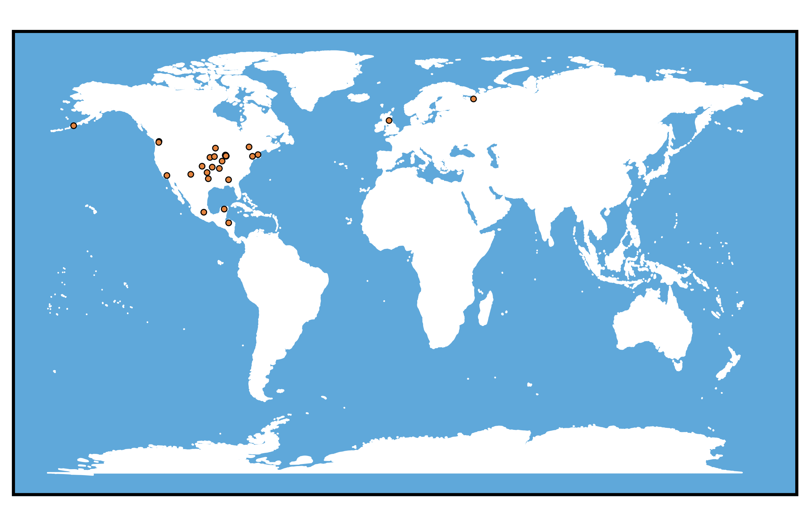
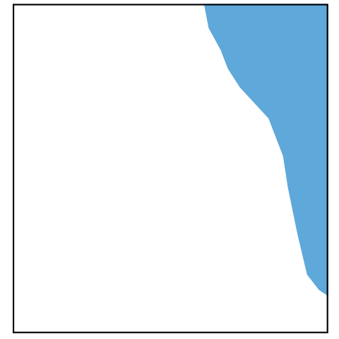
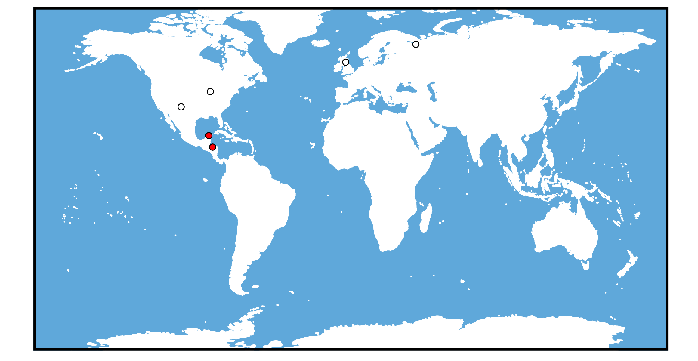
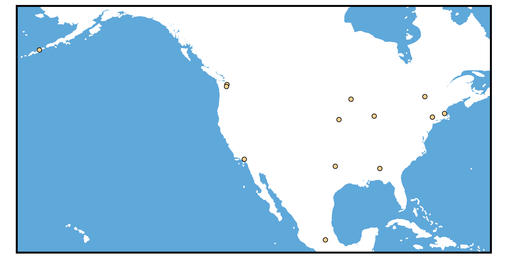

# Locations in The Dresden Files
The Dresden Files are an amazing, silly fantasy series about magic in modern day Chicago. This tutorial will walk through how to makes maps in R using locations from The Dresden Files.

## Getting location data
I had a ton of fun clicking around this [interactive map](https://www.google.com/maps/d/u/0/viewer?mid=1EVEViVHIuS8nXzhz66b7rEwwRqo&hl=en_US&ll=41.88792118153663%2C-87.69842410058595&z=9
) of The Dresden Files locations. I wanted to expand on it by including more locations and adding metadata onto the locations. I've grabbed many of the locations from this map, those curated on two pages on The Dresden Files Wiki [all locations](http://dresdenfiles.wikia.com/wiki/Category:Locations?display=page&sort=mostvisited) and [just Chicago](http://dresdenfiles.wikia.com/wiki/Chicago), then finally added a few of my own for a total of 60 locations. I excluded most of the invented locations for which there is little to no description of the approximate location such as Harry's office and  McAnally's Pub, but I included locations with fuller descriptions such as the Carpenter's home near Wrigely Field and Thomas Raith's apartment in the Gold Coast area.    

Once I had the names of locations (ex: "Shedd Aquarium, Chicago") I used the package ggmap to obtain latitude and longitude information. 

#### Obtaining latitude and longitude with ggmap

I learned to create maps using a helpful [tutorial](https://eriqande.github.io/rep-res-web/lectures/making-maps-with-R.html) and to make animations using the vignette for the package [magick](https://cran.r-project.org/web/packages/magick/vignettes/intro.html).

Importantly, since Eric's tutorial was written an update to Google's Maps Platform now meads that `ggmap::geocode` requires that you have an API key from Google. I went to this [registration page](https://cloud.google.com/maps-platform/#get-started) to sign up for an API key. I "Enabled Google Maps Platform" by following the on screen wizard (selected Maps, generated a project name, and gave billing info). Linking a credit card was less than ideal, so if you have other mapping tools that you prefer please let me know about them! Once I signed up for the Google Maps Platform account, I navigated to APIs & Services and then Credentials. I clicked "Create Credentials" > "API Key." In doing so I was able to generate an API key, which is a string of alphanumeric gobbledegook. 

Back in R, here's how you use your API key and then __finally__ get to search for latitude and longitude. 

```
install.packages("ggpmap")
library(ggmap)
register_google(key = "paste_your_API_key_here")
geocode("Chicago, Illinois")
# A tibble: 1 x 2
    lon   lat
  <dbl> <dbl>
1 -87.6  41.9
```

Now that we can get locations, we can get to plotting on maps! 


I cleaned up my data into a tibble and added some information about the book in which the location first appears and if there is a character or group particularly associated with the location. [To download the data, go to my github repo](https://github.com/katiesaund/dresden_maps). Here's what some of my data looks like: 

```
> install.packages("tidyverse")
> library(tidyverse)
> dresden_locations <- read_tsv("Dresden_Files_locations.tsv")
> head(dresden_locations)
# A tibble: 6 x 6
  Name                                     First_Appearance Character     Group   Lat  Long
  <chr>                                    <chr>            <chr>         <chr> <dbl> <dbl>
1 Burnham Harbor, Chicago                  Death Masks      Thomas Wraith NA     41.9 -87.6
2 Chicago Botanic Gardens                  Cold Days        Summer Lady   NA     42.1 -87.8
3 Cook County Hospital, Chicago            Fool Moon        NA            NA     41.9 -87.7
4 Field Museum of Natural History, Chicago Dead Beat        NA            NA     41.9 -87.6
5 Carbon & Carbide Building, Chicago       Skin Game        NA            NA     37.4 -94.8
6 Graceland Cemetery, Chicago              Grave Peril      NA            NA     42.0 -87.7
```

Two other tools you may want to plot this data: 

```
# Create a .gif of sequential maps
install.packages("magick")
library(magick) 
```

Consider using a [color palette I made](https://github.com/katiesaund/DresdenColor) based on this very same book series: 
```
install.packages("devtools")
devtools::install_github("katiesaund/DresdenColor")
library(DresdenColor)
```

## The most basic of maps
Let's make a map of all of the data! 

```
world_map <- borders("world", 
                       fill = "white", 
                       colour = "white", 
                       bg = "light blue")
  
dresden_locations %>% 
    select(Lat, Long) %>% 
    filter(!is.na(Lat)) %>%
    ggplot() + 
    world_map + 
    coord_fixed(1.3) + 
    geom_point(aes(x = Long, y = Lat), 
               size = 1.5, 
               color = "black", 
               fill = dresden_palette("skingame", type = "discrete")[4],
               alpha = 1, 
               shape = 21) +
    theme(panel.background = 
            element_rect(fill = dresden_palette("colddays", 
                                                type = "discrete")[4], 
                         size = 0.0),
          panel.border = element_rect(colour = "black", fill = NA, size = 2),
          panel.grid.major = element_blank(),
          panel.grid.minor = element_blank(),
          text = element_blank(), 
          axis.ticks = element_blank())
```

This code yields a plot of every Dresden Files location: 
 

If you didn't know it already, this map makes is pretty clear that The Dresden Files are set in the Midwest. This map is fine, but it doesn't clue us into much else about the marvelous world created by Jim Butcher. 

# Plotting the locations by their order of appearance  
Next, I plotted as many of the Chicago locations from Books 1-15 + *Side Jobs* + *Brief Cases* that I could assemble. Each image in the animation adds locations from each book, sequentially. We can see how much more rich the Chicago environment beomes with each new adventure.  
 

To make the gif I first made a map for Book 1 (Storm Front), saved it. Then I made a second map for locations from books 1 and 2 (Storm Front & Fool Moon). I continued until I had all of the locations included on the final map. Then I saved the individual pictures into a gif. 

### Here's an outline for how to build it yourself, using code for just the first three books: 

Set up some things you'll need:
```
# A color palette (one color per book) 
col_palette <- dresden_palette("foolmoon", n = 3, type = "continuous")

# A color for Lake Michigan
lake_col <- dresden_palette("colddays", type = "discrete")[4]

#  A map of the Chicago area
state_map <- map_data("state", region = "illinois")
base_map <-  ggplot() + 
  geom_polygon(data = state_map,
               aes(x = long, y = lat), 
               fill = "white",
               color = "white") + 
  coord_fixed(xlim = c(-88.25, -87.565),  
              ylim = c(41.70, 42.25),
              ratio = 1.3) + 
  theme(panel.background = element_rect(fill = lake_col),
        panel.border = element_rect(colour = "black", fill = NA, size = 2),
        panel.grid.major = element_blank(),
        panel.grid.minor = element_blank(),
        text = element_blank(), 
        axis.ticks = element_blank())
ggsave("base_map.png")
```

Then you'll need to subset to the locations in each book, then create a "geom_point" for each book. 
```
StF_loc <- dresden_locations %>% filter(First_Appearance == "Storm Front")
FM_loc <- dresden_locations %>% filter(First_Appearance == "Fool Moon")
GP_loc <- dresden_locations %>% filter(First_Appearance == "Grave Peril")

create_geom_point_for_book <- function(book_locations, color){
  temp <- geom_point(data = book_locations, 
                     aes(x = Long, y = Lat), 
                     size = 3, 
                     fill = color,
                     alpha = 0.5, 
                     shape = 21)
  return(temp)
}

storm_front_geom <- create_geom_point_for_book(StF_loc, col_pal[1])
fool_moon_geom <- create_geom_point_for_book(FM_loc, col_pal[2])
grave_peril_geom <- create_geom_point_for_book(GP_loc, col_pal[3])
```

Now create a map including all of the locations previous to and including the current book: 
```
including_storm_front_map <- base_map + storm_front_geom
ggsave("including_storm_front_map.png")
including_fool_moon_map <-  including_storm_front_map + fool_moon_geom
ggsave("including_fool_moon_map.png")
including_grave_peril_map <- including_fool_moon_map + grave_peril_geom
ggsave("including_grave_peril_map.png")
```
To get the animation to work correctly you need to have saved each of you maps, then read them back into R using `magick::image_read().`

```
base_map <- image_read(path = "base_map.png")
including_storm_front_map <- image_read(path = "including_storm_front_map.png")
including_fool_moon_map <- image_read(path = "including_fool_moon_map.png")
including_grave_peril_map <- image_read(path = "including_grave_peril_map.png")
maps <- c(base_map, 
          including_storm_front_map,
          including_fool_moon_map, 
          including_grave_peril_map)
```

Last, create a gif of all of your locations and then save them. 

```
image_animate(image_scale(maps), fps = 1, dispose = "previous")

# Save
maps_animation <- image_animate(image_scale(maps), 
                                fps = 1,
                                dispose = "previous")
image_write(maps_animation, "maps_animation.gif")
```

# Red Court vs. White Council  
I've recently been listening to the audiobook for Changes so the war between the Red Court and the White Counil is fresh in my mind. Here I have some of their relevant locations by faction. White Council locations include HQ in Edinborough, Camp Kaboom, and Archangel. For the Red Court I focused on just Chichen Itza and Casaverde; we're told they control much of South America but without any specifics listed in the novels I'll leave that to your imagination.  

```
ocean_col <- dresden_palette("colddays", type = "discrete")[4]
world_map <- borders("world", 
                     fill = "white", 
                     colour = "white", 
                     bg = "light blue")
dresden_locations %>% 
  filter(Group %in% c("Red Court", "White Council")) %>% 
  ggplot() + 
  world_map + 
  coord_fixed(xlim = c(-180, 180),  ylim = c(-75, 75), ratio = 1.3) + 
  geom_point(aes(x = Long, y = Lat, color = Group, fill = Group), 
             size = 2, 
             alpha = 1, 
             shape = 21) +
  theme(panel.background = element_rect(fill = ocean_col, size = 0.0),
        panel.border = element_rect(colour = "black", fill = NA, size = 2),
        panel.grid.major = element_blank(),
        panel.grid.minor = element_blank(),
        text = element_blank(), 
        axis.ticks = element_blank()) + 
  theme(legend.position = "none") + 
  scale_color_manual(values = c("black", "black")) + 
  scale_fill_manual(values = c("red", "white"))
  ```

 

# The Paranet  
Finally, I've compiled all of the Paranet locations explicitly listed. For locations where only a state or country was mentioned rather than a specific city I simply assigned the location to the relevant capital. The Paranet is such a wonderful concept and I love everytime we get to meet new Netters. Hopefully. we get to hear about some more of the global paranet locations in the future. Where do you think will be next?  
```
ocean_col <- dresden_palette("colddays", type = "discrete")[4]
col_pal <- dresden_palette("briefcases", n = 17, type = "continuous")
paranet_col <- col_pal[4]
dresden_locations %>% 
  filter(Group == "Paranet") %>% 
  ggplot() + 
  world_map + 
  coord_fixed(xlim = c(-65, -167),  ylim = c(19, 60), ratio = 1.3) + 
  geom_point(aes(x = Long, y = Lat), 
             size = 2, 
             color = "black", 
             fill = paranet_col,
             alpha = 1, 
             shape = 21) +
  theme(panel.background = element_rect(fill = ocean_col),
        panel.border = element_rect(colour = "black", fill = NA, size = 2),
        panel.grid.major = element_blank(),
        panel.grid.minor = element_blank(),
        text = element_blank(), 
        axis.ticks = element_blank())
```

 

Be sure to let me know about all of the locations I have forgotten to include. 

Info on my R and package versions: 
```
R version 3.6.1 (2019-07-05)
magick_2.2             
DresdenColor_0.0.0.9000 
tidyverse_1.2.1         
ggmap_3.0.0      
```

