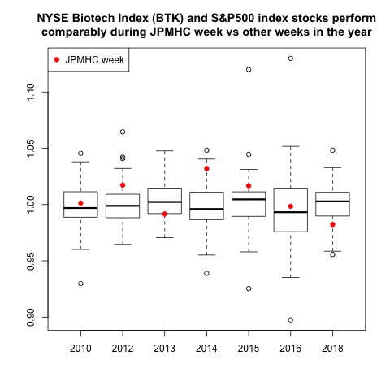

## What is JPMHC? What does it have to do with biotech stocks?  

The J. P. Morgan Healthcare Conference is an annual get together of pharma and biotech bigwigs in San Francisco, CA. During JPMHC week 2019 (#JPMHC2019) I wondered how much of an impact this conference has on healthcare stock values. It's considered common knowledge that stocks change in response to the speeches, deals, and data presented at the meeting. I've found some sources that attempt to quantify the impact of the meeting on stocks (see below), but I wanted to (a) evaluate the data myself, (b) work with financial data for the first time in R, and (c) practice using tidyverse approaches.

Here's a [source that tries to quantify the impact of JPM week on biotech stocks](https://www.cnbc.com/2017/01/04/betting-on-biotech-during-jpmorgans-big-health-care-conference-pays-off-history-shows.html). Quotes from the article include: 

* "Biotech has historically outperformed the broader market during The J.P. Morgan Healthcare Conference"
* "In the past 16 years, the NYSE Arca Biotechnology index (BTK), which measures the performance of 30 biotechnology firms, has outperformed the S&P 500 index by nearly 3 percent during JPMorgan's conference"

Given this, I hypothesized that:

1. Healthcare stock prices tend to fluctuate more during JPM week than any other week in the same year.
2. The biotech sector outperforms the S&P 500 during JPM week more often than is expected by chance.

The analysis presented in the accompanying [**R Code**](https://github.com/katiesaund/JPM_Healthcare_2019/blob/master/2019-05-27_JPM_week.Rmd) preliminary. Advice from people familiar with analyzing finanical data is most welcome.

## Analysis: 
### Do healthcare stock prices tend to fluctuate more during JPM week than any other week in the same year?

I downloaded all of the NASDAQ and NYSE stock tickers and subset them to only include "Health Care" sector companies. For each of these healthcare stocks I downloaded historical prices from 1983 - 2017. Then I calculated the range in price for every week (maximum price minus minimum price) for each healthcare stock. I tabulated the number of weeks per year when the price range for the stock was smaller than price range the week of JPMHC. I looked at so many stocks that I needed to summarize the aggregate data in the following graph.
  

  
This isn't at all what I was expecting. I hypothesized that for many stocks its price range during JPMHC week would be greater then its price range most other weeks of the year. My intuition was way off. The fluctuations in price during JPMHC week actually pretty small: from 1983 ~ 2013 JPMHC week stocks had less flucations than half the year! It's only been in the last few years that JPMHC week healthcare stock fluctuations have become larger and larger compared to the rest of the year. Perhaps this trend is due to increasing size and coverage of the conference?  

### Does the biotech sector outperform the S&P 500 during JPM week more often than is expected by chance?
I downloaded historical stock prices for three indices: NYSE Biotech ("BTK"), NASDAQ Biotech ("NBI"), and S&P500 ("SPY") from 2010-2018, which is a date range with data from all three indices.  

The two biotech index stocks behave similarly over the date range.

For each week in the year I got the performance of each index by calculating the index's weekly closing price by the weekly opening price. Then I found the relative performance of the S&P500 versus the biotech indices by diving the biotech index performance by the S&P500 index performance. Below I plotted this metric of relative performance by year. I've highlighted JPMHC week in red. Though the relative performance of the biotech index during JPMHC week is sometimes higher than the S&P500 index, it's clearly nothing special (and not statistically significantly different).  
 

## My Conclusions: If JPMHC affects biotech stocks, its within the noise of the market. 
My analysis of the stock data contradicts my intution that was built upon the prevailing sentiment regarding the affect of JPMHC week on biotech stocks. As with most of my analyses, I'm left with more questiosn: what assumptions are baked into my model and how should I validate them? I made some simplifcations for this analsis, were they jusitified? Do I need to redefine my definitions of flucation and performance? How did my approach different from the article that inspired me? 
