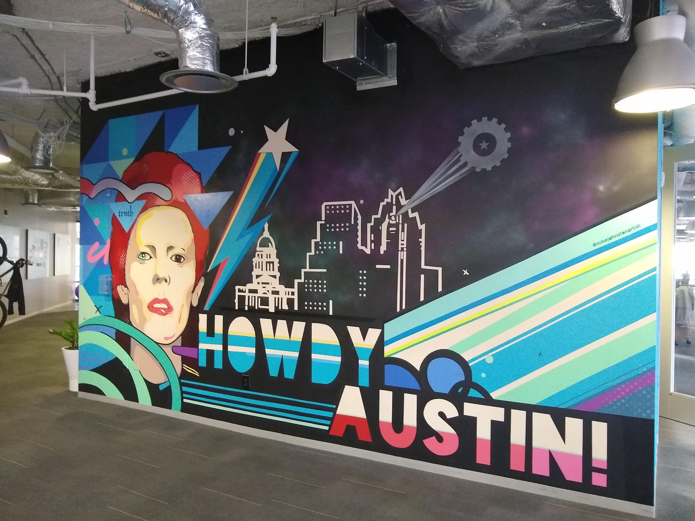

  
## *The* Venture Capital Competition for Professional Students
The [Venture Capital Investment Competition](https://www.vcic.org/) is the “world’s largest venture capital competition with over 70 universities competing. VCIC is the only place where students get to be VCs for the day.” Though I’m sure student funds, such as the [Dorm Room Fund](https://www.dormroomfund.com/) and [Contrary Capital]( https://contrarycap.com/), would argue that students can be investors while still in school.  

In the competition each university team hears pitches from three businesses and drafts a term sheet for the most promising venture. In February 2019 I traveled with my talented teammates from the University of Michigan's Ross School of Business to participate in a regional competition at UT Austin’s McCombs School of Business. 

## Due diligence dash
A day and a half before we met the founders we were sent each company's slide decks. This was our first information of any kind about the businesses to be considered. Our team started reading everything we could find relevant to the three companies. All the companies were quite different (stage/funding, sector, technology, etc...). 

I did take a short break to visit the Capital Factory, an Austin-based accelerator. The space's vibe was electric, even though it was still weeks prior to SXSW. The views of the city skyline were unparalleled. Here's one particularly striking mural:  
. 
It was the first place where I'd seen a VR "treadmill" in person (it looked like a [KAT Walk Mini](https://katvr.com/product/kat-walk-mini/) or a [Virtuix Omni](https://www.youtube.com/watch?v=1SlZvuhABGk)). I would have loved to try it out-- but it was high time for me to get back to due diligence on the three companies. 

Based on our fund profile, we needed to identify companies with massive returns. Based on our initial research, even before meeting the companies, we were pretty sure we'd found our winner so we even wrote a tenative the term sheet to be updated with insights from meeting the founders. 

## Bright and early: Business pitches
Three companies generously took the time to give cogent, invigorating pitches to us graduate students. After the sell to all of the competitors, each team met with individual companies alone. These meetings were our chance to get to know the founders (How did they meet? What inspired the company?), clear up issues regarding financials (cap table, run way, burn rate), drill down on the product, guage traction and the receptivity of the market. 

Meeting the founders was a delight. Even while working under tight time constraints these entrepreneurs were charismatic, articulate, and persuasive. I wanted more time with each one to talk more about their business aspirations. But, in the end our team of five had only 15 minutes to in/validate our investment theses so the time went by quickly. 

## A working lunch: drafting the term sheet
During the lunch hour our team updated our prior assumptions about each company based on both the pitches and the meetings. We decided to stick with the company we had identified the night before based on the great information we recieved from the founders during the meeting. It was a made dash to get it done, but the term sheet got submitted just in time. 

## Selling the deal to our partners

## A heartbreaking loss

## Thanks to the team & our mentors in Ann Arbor 
