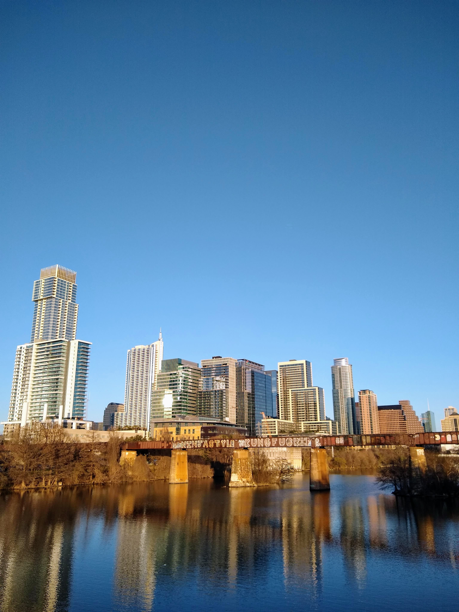
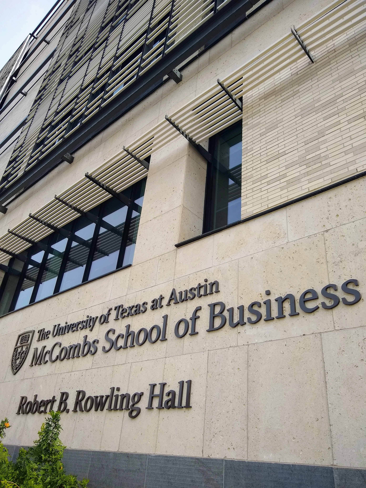
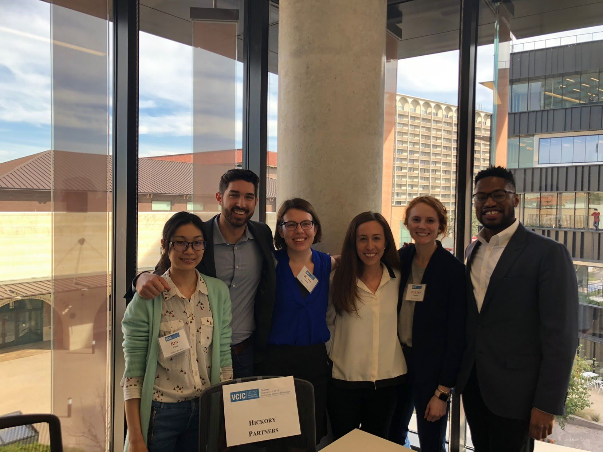

  
## *The* Venture Capital Competition for Professional Students
The [Venture Capital Investment Competition](https://www.vcic.org/) is the “world’s largest venture capital competition with over 70 universities competing. VCIC is the only place where students get to be VCs for the day.” Though I’m sure student funds, such as the [Dorm Room Fund](https://www.dormroomfund.com/) and [Contrary Capital]( https://contrarycap.com/), would argue that students can be investors while still in school.  

In the competition each university team hears pitches from three businesses and drafts a term sheet for the most promising venture. In February 2019 I traveled with my talented teammates from the University of Michigan's Ross School of Business to participate in a regional competition at UT Austin’s McCombs School of Business. 

## Due diligence dash
A day and a half before we met the founders we were sent each company's slide decks. This was our first information of any kind about the businesses to be considered. Our team started reading everything we could find relevant to the three companies. All the companies were quite different (stage/funding, sector, technology, etc...). 

I did take a short break to visit the Capital Factory, an Austin-based accelerator. The space's vibe was electric, even though it was still weeks prior to SXSW. The views of the city skyline were unparalleled. Here's one particularly striking mural:  
  
It was the first place where I'd seen a VR "treadmill" in person (it looked like a [KAT Walk Mini](https://katvr.com/product/kat-walk-mini/) or a [Virtuix Omni](https://www.youtube.com/watch?v=1SlZvuhABGk)). I would have loved to try it out-- but it was high time for me to get back to due diligence on the three companies. 

Based on our fund profile, we needed to identify companies with massive returns. Based on our initial research, even before meeting the companies, we were pretty sure we'd found our winner so we even wrote a tenative the term sheet to be updated with insights from meeting the founders. 

## Bright and early: Business pitches
Three companies generously took the time to give cogent, invigorating pitches to us graduate students. After the sell to all of the competitors, each team met with individual companies alone. These meetings were our chance to get to know the founders (How did they meet? What inspired the company?), clear up issues regarding financials (cap table, run way, burn rate), drill down on the product, guage traction and the receptivity of the market. 

Meeting the founders was a delight. Even while working under tight time constraints these entrepreneurs were charismatic, articulate, and persuasive. I wanted more time with each one to talk more about their business aspirations. But, in the end our team of five had only 15 minutes to in/validate our investment theses so the time went by quickly. 

## A working lunch: drafting the term sheet
During the lunch hour our team updated our prior assumptions about each company based on both the pitches and the meetings. We decided to stick with the company we had identified the night before based on the great information we recieved from the founders during the meeting. It was a made dash to get it done, but the term sheet got submitted just in time. The 'term sheet' for this competition is a very abbreviated document: no legalese and a focus on big ticket items such as valuation, investment size, liquidation preference, option pool, and board structure.  
  
A template of the competition's simplified term sheet is available on the VCIC website as a ['deliverables template'](https://www.vcic.org/students/).  

## Selling the deal to our partners
Our last task of the competition was to convince our firm's "partners" that we had identified a company that could return our fund. The partners were the competition judges: several local angels and venture capitalists. We gave a short oral presentation explaining why the company we hoped to partner with the company we chose after which the judges jumped in with rapid fire questions to assess our logic and assumptions. The back and forth with the judges was excellent because the judges were teaching us in addition to assessing; they asked leading questions to hint at their own opinions and get us to explain our reasoning in the light of their differening opinions. 

The only truly negative part of this experience was the dissonance between the constraints of the competition and the reality of investing. A VC fund has to hold companies up to extrememe scrunity because only very few companies can fit a fund's requirements for returning the investors' money. While I liked all of the companies we saw, none were a truly good fit for the VC fund profile we were working from. Every time the judges asked a question that pointed out an issue in our investment size / valuation etc... all I wanted to say was "Hey, I wouldn't invest in this company if this was real money -- this company is too late (or too early) for this fund. Maybe I'd recommend them to an angel I know or fund that focuses on Series C and later investments." But I didn't feel that was appropriate-- I felt that I had to double down on the fantasy of the competition. Now I wonder how the judges might have reacted to breaking the illusion? 

## A heartbreaking loss
We did not take home the win. The winning team, Vanderbilt, went on to compete at the global competition in April, but it was Georgetown University that took home the gold. Go Hilltoppers! 

Our main piece of negative feedback was that our deal was "too Silicon Valley." I suppose this means too speculative or risky? We weren't wearing hoodies or jeans, so I don't think our dress code was the problem. 

## So many people to thank! 
The VCIC is the fruit of labor of many volunteers. I thank the Austin cohort: the hosts (students, staff, and professors) at UT Austin who helped us to feel at home in the business school, the founders who spent half a day pitching and sitting in meetings, and the judges. I thank our sponsor and mentor Anne Perigo, who is the Associate Director of the Zell Lurie Institute at Ross. I thank the Mikes (Mike Johnson and Michael Godwin) who spent many hours teaching the basics of VC to the team. Thank you to the ZLI staff who made the internal competition back in November and travel to Texas possible. 

Finally, I was very lucky to work with an **amazing** team. These folks are all fantastically talented. I was the only non-MBA on the team, but I couldn't have felt more welcome and supported. Thank you to Rin, Joe, Becca, Jill, and David! We look pretty good in a corner office, don't you think?

